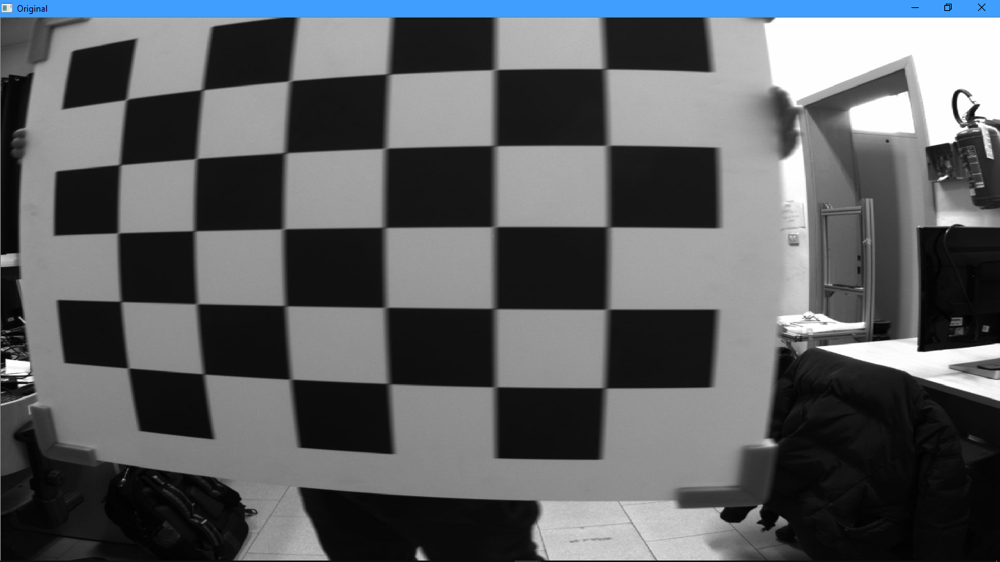
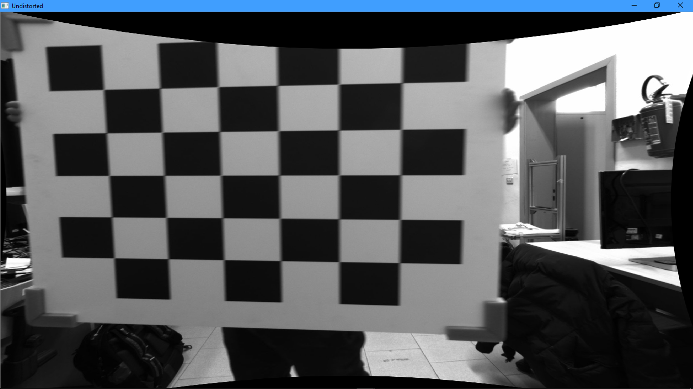
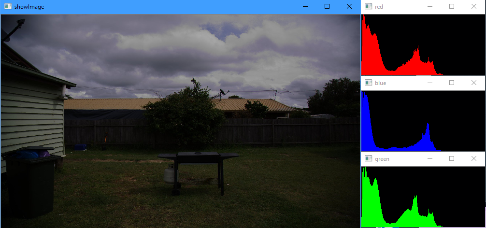
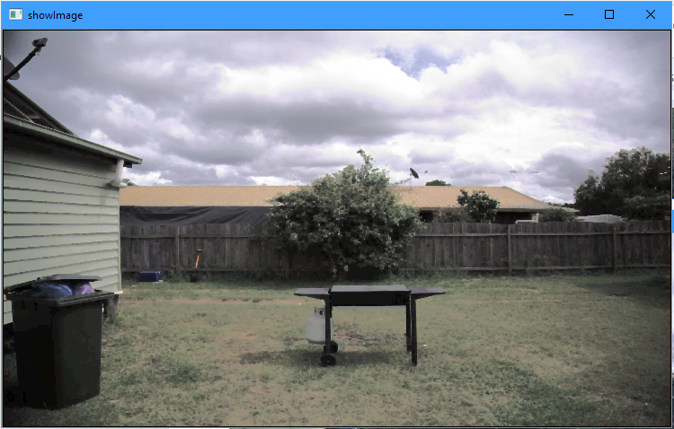
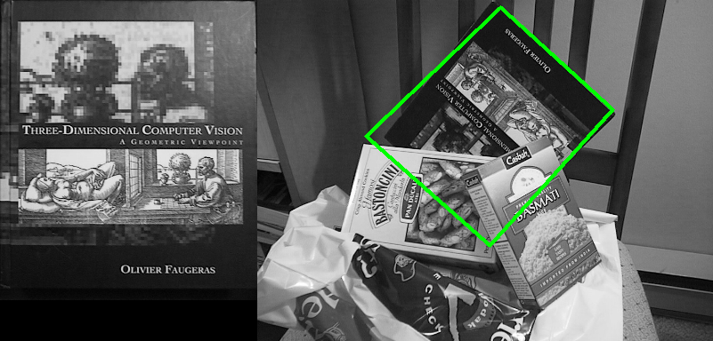
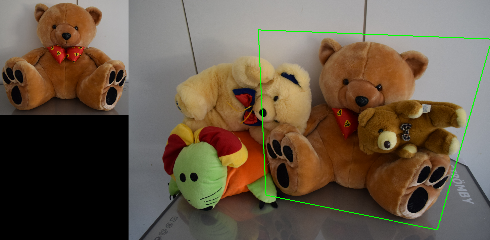
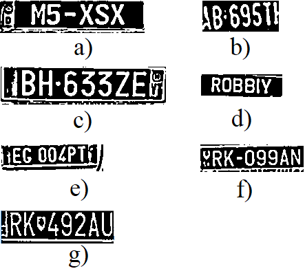
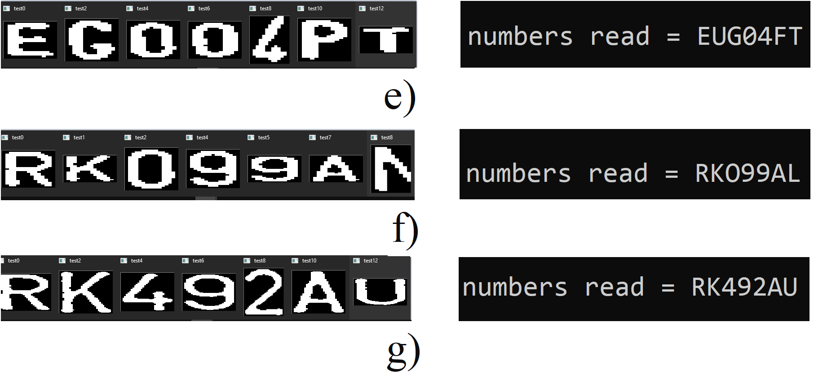

# Computer Vision - CV
A collection of four CV application: 
- Camera calibration
- Image Denoising
- Object recognition
- Plate recognition

The scripts are written in C++ with [OpenCV 4.1.x](https://opencv.org/). 

> **Inside every model's folder there is PDF with the full description of what I do and why from a theoretical point of view.**

Here a brief description for every project:

# Camera calibration
Given a set of photos (all from the same camera) of a checker-board the required tasks are:
- Detects the checker-board in every image;
- Calibrates the camera;
- Compute the mean projection error;
- Show the name of the images with the best and worst re-projection error;
- Un-distort and rectify a test image acquired with the same camera as the calibration set.

>
>*FTest image without correction.*

>
>*Test image after correction*

# Image Denoising
Given a photo, the required tasks are:
* Part 1:
  * Print the histograms of the image (R,G,B);
  * Equalize the RGB channels and show the new image;
  * Change the colour space and try to equalize a single channel. Show the results.
* Part 2:
  * De-noise the result of the last picture generated from part1;
  * The filters to try are: median, Gaussian and bilateral filters.
* Part 3:
  * Try to remove the electronic cables from the "barbecue picture" using morphological filters.

> 
>*Original image and its RGB histograms.*

> 
>*Effect of a custom morphological filter.*

# Object recognition
Given a set of objects photos and scenes pictures made from these objects, the required tasks are:
- for every object and scene couple, find and highlight the object in the scene;
- display the result as a figure with the object and the scene pictures side by side; the scene photo
should have the found object in a coloured square.

> 
>*Dataset 2, Three dimensional computer vision is detected.*

> 
>*Dataset 4, the big bear with a red papillon keeping only the 10% of the best matches.*

# Plate recognition
Given a set of photos of cars, it is required to develop an application in c++ able to:
- detect the licence plate;
- read the various single characters in the licence plate.
Given the length of the task, two classes have been implemented:
- ExamClass: does the preprocessing of the input image, detects and extracts a plate;
- ExamClassPlates: detects and extracts the single characters from a plate.

**The program has been tested only on the given dataset.**

> 
>*a), b), c), d), e), f), g) are the detected and extracted plates after preprocessing.*

> 
>*e), f), g) final results.*

**For the image recognition part, I've used the [OpenCV_3_License_Plate_Recognition_Cpp](https://github.com/MicrocontrollersAndMore/OpenCV_3_License_Plate_Recognition_Cpp).**
